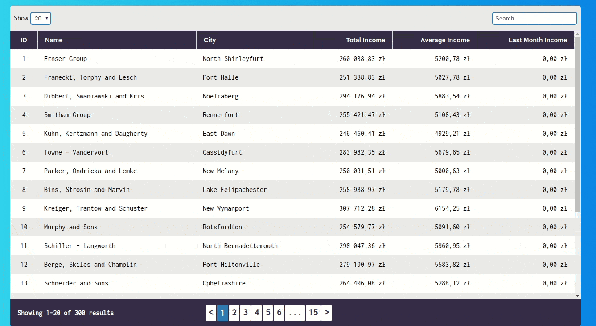
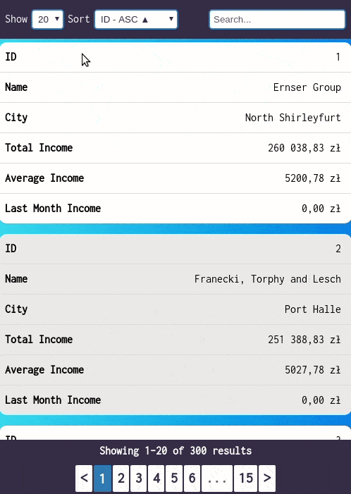

# Companies Check
## Description
A simple website that retrieves data of companies and presents their incomes in the form of a table.  
Made for recruitment purposes.

## Preview
Website is hosted on Netlify and it's available for [preview].

---

 <p align="center"> 
    
 </p>

## Installation
Clone this repository and install dependencies inside project directory.
```
git clone https://github.com/Wojciech-Florczak/companies-check.git
cd companies-check
npm install
```
## Usage
To run this project in development mode use:
```
npm start
``` 

## Configuration
In App.js file you can specify:
```javascript
const config = {
  itemsPerPage: [10, 20, 30],
  defaultItemsPerPage: 20,
  sortBy: "id",
  searchDebounce: 400,
  headers: {
    id: "ID",
    name: "Name",
    city: "City",
    totalIncome: "Total Income",
    averageIncome: "Average Income",
    lastMonthIncome: "Last Month Income"
};
};
```
---

## Pages
### Home
The main page that stores most of the application's logic and renders all components.  
When the user enters the page it makes an initial request to the server to display the first page of results. A number of results depend on the number specified in config in App.js.  
After that app makes requests to get the rest of the results. It improves UX because in order to display every result app has to make 300 requests and do math operations to calculate incomes of companies which takes a few seconds, but when the initial request is made first results are displayed to the user almost immediately.

---
## Components

### Pagination
Generate page numbers based on number of results.  

### SearchBox
Filter results based on a user input. It uses Object.values to iterate through all fields in the table.  
The search input is wrapped in a debounce hook, that allows you to set a time delay before performing the search. In this case, it is not that useful because it performs searching on data stored in the state, but it can be used to limit the number of requests sent to the server.

### QuantityToShow
Display buttons that allow you to change how many results are displayed per page.
You can configure it by changing the config in the App.js file.

### Table
Render the whole table. You can specify headers in config in App.js using key-value pairs.

### TableHeader
Used to display header in the table. When clicked one time it sorts the table in ascending order when clicked the second time it sorts the table in descending order.

### TableRows
Render table rows based on results. Before initial fetch is made, this component renders empty rows based on defaultItemsPerPage value from config.

### DropdownSort
Display dropdown list to choose sorting option.
It was made to allow sorting on smaller devices because header disappear on certain breakpoint

---

Created with [Create React App](https://github.com/facebook/create-react-app).

[preview]: https://stoic-lamport-fac389.netlify.com
